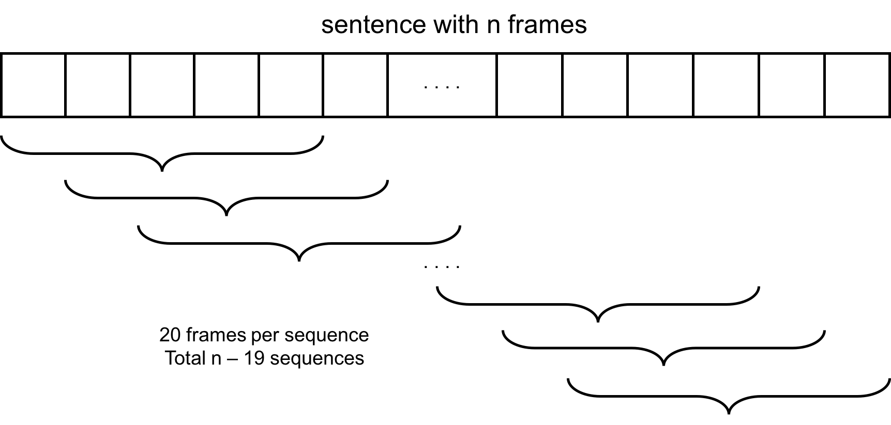
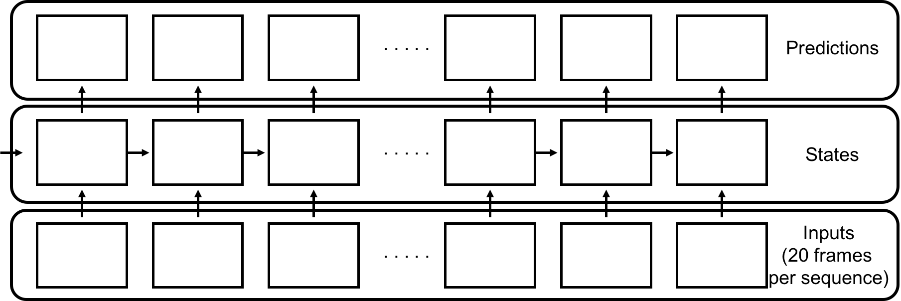
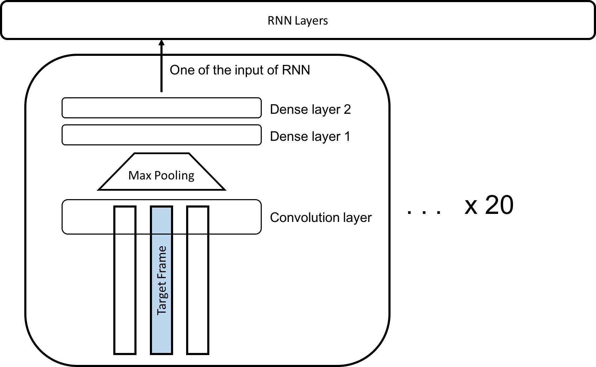

# HW1 - Sequence Labeling

## RNN

我將 20 個 frame 組成一個 sequence，送進由 LSTM 組成的 RNN cell 來預測送進去的 sequence 每一個frame 分別對應的 label。為了避免取 sequence 的時候跨越不同的句子，將並非相鄰的 frame 當成連續的資訊處理，我獨立的將每一個句子分開處理。為了增加 sequence 的數量，取出來的 sequence 之間會有重疊的部分，類似像 sliding window 一般一次滑動一個 frame 作取樣，也就是說一個長度為 n 個 frame 的句子，可以取出 n - 19 個 sequence。

 

## CNN + RNN

我將 CNN 加在 RNN input 那一端，將輸入的資料先做前處理，再把處理過後的資訊送進 RNN 中訓練。第一層 convolutional layer，對於每一個 sequence 中的 frame，將其前後兩個 frame 一起納入考量，並以 `3 x 3` 大小當作 filter (也就是說，每一次看 3 個 frame，每一個 frame 看其中 3 個維度的 feature)，總共 32 個 filter。經過第一層之後，利用 max pooling 以 `2 x 2` 的 filter，對 feature 進行降維 (feature axis stride 取 2，讓 feature 的 dimension 變成一半)。最後經過兩層 fully connected neuron network 當作 dense layer，第一層 1024 個 neuron，第二層 48 個，也就是總共的 label 數量先行用 CNN 做分類。因此，最後的整個架構變成長度為 20 的 RNN sequence，每一個 frame 對應到一整組 CNN layers。

 
 

## Improve Performance

首先，由於我們的 sequence 之間有大量的重疊，因此如果我們將分配好的 sequence 依序送進 RNN 中，在做 training 的時候會產生很明顯的 bias。解決的方法是在把 sequence 送進去之前，先做 shuffle，因此每一個 epoch 所面對的是續都不一樣。注意，這裡做 shuffle 的是「所有 sequence 的順序」，並非 sequence 裡面 20 個 frame 的順序 (frame 的順序是不可以改動的)。在進行 shuffle 過後，train 出來的結果有明顯的提升。另外，在 RNN 那邊使用 multi layer RNN，效果也會有所提升。

 
 

## Experiments and Future Improvements

在本來的 RNN 上，幾乎完全沒有更動下，僅僅在 input 加上 CNN 前處理，成果皆有所提升。不過因為複雜度明顯的增大，training 所需的時間也膨脹到 RNN 的十多倍，Tensorflow save 的 model 大小也從 2MB 提升到了快 900MB。

由於自己開始的時間較晚，沒有太多的時間做許多實驗，使用的各項參數也沒有 fine tune 到 optimal。其中一個我有完成的 feature 是將 RNN 那一層改成 bidirectional RNN，本來預期效果會有顯著的提升，因為在 training 的時候回報的 accuracy 有所進步，不過在實際送上 Kaggle 之後發現到分數意外的差。我得到的結論是應該是加了太多 network，導致對 training set overfit。由於效果不甚理想，因此最終並沒有包含在結果之中。

其中一個想到能夠解決 overfitting 的方法是使用 cross validation，也就是說將 training set 中的一部分當作計算 loss function，但是不將其送入 training 的 input 中。這樣可以利用沒有被 fit 過但是知道 label 的資料，當作是否接近正解的標準。
