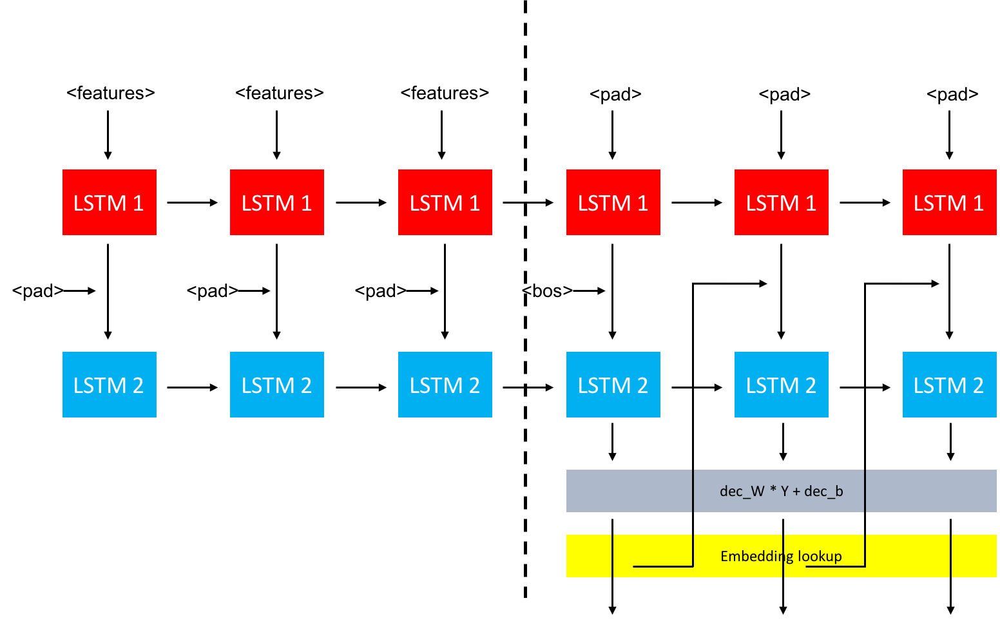
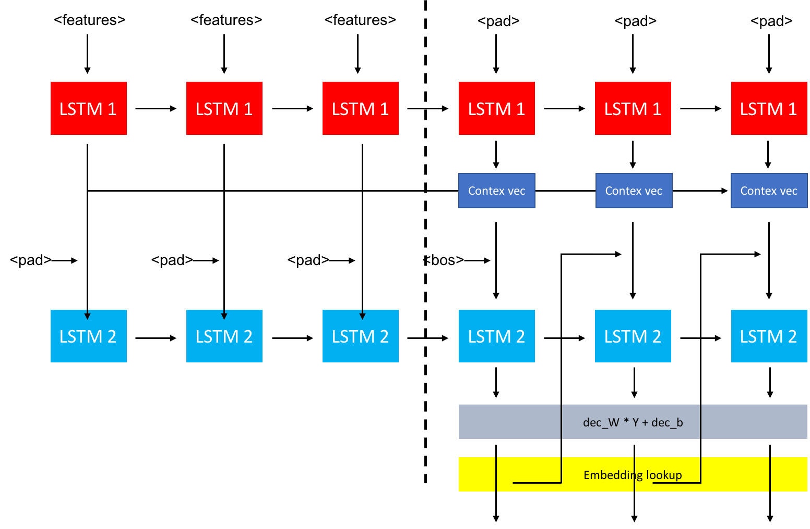

# HW2 - Video Captioning

## Model - Vanilla seq2seq (no attention)

與作業投影片內作法相同，比較細節的指出，lstm2 的 output 含需要經過一層 output layer，將輸出轉換成一個 vector，每一個 entry 代表候選字的機率。找到 argmax，再使用 `index->word` 的 mapping 及可以輸出文字。另外，前一個 lstm2 的 output 在經過 output layer 轉換之後，還要經過 embedding lookup，才會再將這個結果傳到下一個 timepoint。

 
 
 
 
 
 
 

## Model - With Attention

與上一張圖類似，不過在 lstm1 與 lstm2 之間，加上一個 attention layer。其中取 weighting 的方式是將 decode step lstm1 output ($h_t$)、encode step lstm1 output ($h_s$)、一個 $hidden\_dim \times hidden\_dim$ 大小的陣列 ($W$)，三個相乘 ($h_t^T \times W \times h_s$) 得到一個 scaler。對於每一個 encode step lstm1 output，將每一個對應的 scaler 算出來後做 softmax，這個 vector 正是取 encode step lstm1 output 取 sample 的 weight。我們的目標是 train 出一個好的 $W$。

不過實際跑出來的結果卻並沒有變好，反而讓輸出的句子每一句話的開頭都怪怪的。雖然在 training 過程中的 loss 不高，但是實際生成的句子由於文法怪異，導致 bleu 的分數非常低。因此我認我應該是我對 attention model 的理解還沒有很透徹，在作業截止之前仍未找到錯誤的地方以進行修正。我認為，錯誤的位置應該在 decoder stage 的一開始初始的地方，因為句子其實後半部分都尚可，唯獨一開始的地方毫無邏輯可言。

 
 
 
 
 

## Improvements

在每一個 training epoch，我都會將所有的資料全數 shuffle 一遍，避免 bias 產生。另外，在做 training 的時候，我有將 testing data 的 caption label 加進 vocabulary 中 (並沒有將句子加入 training set中，因為這樣是作弊)，增加總詞彙量以達到更好的效果。

## Experiments

我有嘗試在 lstm1 那一層中增加 hidden layer 的數量 (將 BasicLSTMCell 換成 MultiRNNCell)，發現效果並不顯著，bleu 分數反而略低於沒有
 multilayer 的情況。做 training 時，epoch 也不需要太多 (3 - 6 次最佳)，太多反而會有 overfitting 的情形出現。