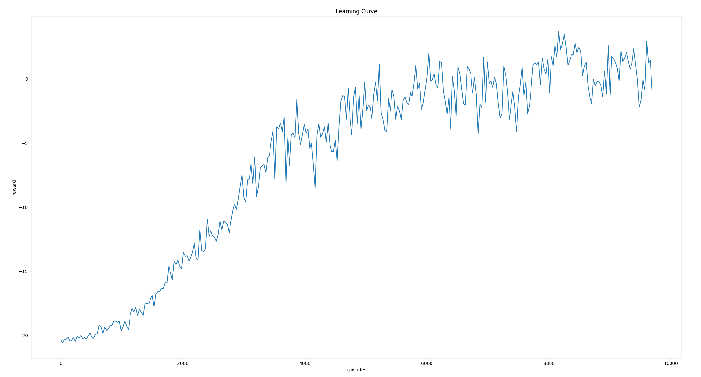
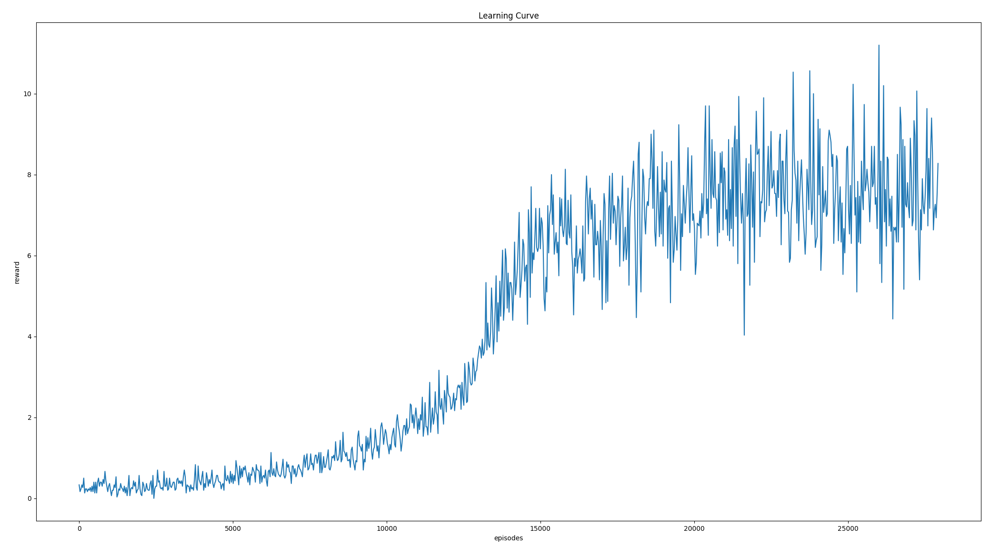
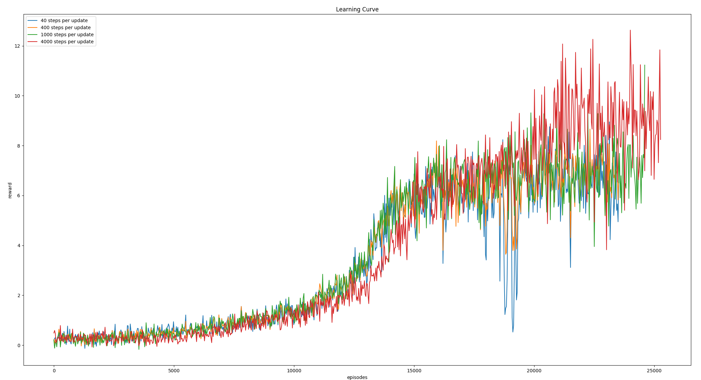

# HW3 - Game Playing
B03901034 吳泓霖

## Models

### Policy Gradient
以下是 model 的架構：


將 raw pixel downsample 到 80 x 80 後，將背景顏色設為 0 ，其他 (例如球和 pad) 則是 1，也就是我們想要看到的部分。  
我將整個圖片資訊，直接通過兩層 fully connected neural network，透過 policy gradient 做 feedback 進行 training

下圖是 episode 對 reward 做圖 (learning curve)



到後期因為 training 速度實在是太慢，而且看不太出明顯的進步，因此便停止訓練 (有通過 baseline)

### DQN
以下是 network model 的架構：


Q network 和 target network 兩個的架構一樣，都是如上圖所示。  
其中，用到的 training parameters 如下：

```
learning_rate = 0.0001
gamma = 0.99
batch_size = 32
memory_size = 10000
epsilon = 1
epsilon_decay = 1e-6
epsilon_min = 0.05
steps_per_Q_network_update = 4
steps_per_target_network_update = 1000
```

下圖是 episode 對 reward 做圖 (learning curve)



在跟同學們討論後發現，到後面 reward 不會很穩定，很有可能在 checkpoint 之間，testing 出來的結果差距非常大。在模型相同情況下，每次 train 出來的結果都差距頗大，有人訓練非常少 timestep 便能通過 baseline。然而因為時間的關係，我還沒有 train 出可以通過 baseline 的 model。


### DQN Hyperparameters

我選擇針對 target network update frequency 來做實驗，以下是 4 種不同情況下的 learning curve：



從圖可以看出，update 的頻率越低 (越多 step 才去 update 一次 target network)，其效過較佳。