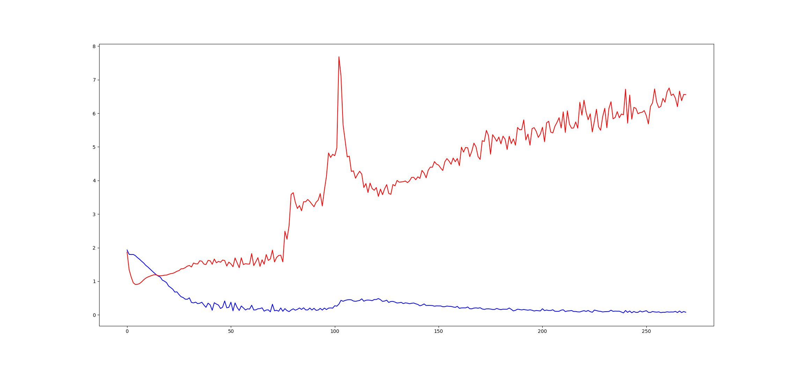

# HW4 - Generative Adversarial Networks
B03901034 吳泓霖

## Model
本次作業我使用 DCGAN。Generator 的部分使用 1 層 linear matrix，4 層 convolution network，層與層之間 activation function 使用 relu，最後 output 將最後一層 conv network 的結果跑 tanh。Discriminator 的部分則是使用 4 層 convolution network，1 層 linear matrix，層與層之間 activation function 使用 leaky relu (有做 batch normalization)，最後 output 則是將 linear matrix 的結果通過 sigmoid。

關於 loss objective function 的部分，我將一組 feature vector 送進去， real image 的結果應該為 1，wrong image 的結果應該為 0，fake image (generated) 的結果應該為 0，因為沒有送所謂 "wrong captions"，所以只有以上三種情形。Optimization 則是分別對 generator 與 discriminator 的結果與預期結果之間做 sigmoid cross entropy，再經過 reduce mean 出來得數值做 minimization。

## Improvements
我並沒有使用任何 text feature extraction model，而是單純將 tags 中有關於髮色與瞳色有關的 tag 取出，每一種 tag assign 一個 index，因此對於每一個圖片，他的 feature 就是一個 length 為 23 的 vector，一種 "multi-hot vector" 的概念。這麼做不僅讓 preprocessing 變得非常快，也大大減少 feature 的複雜度。因為 testing 僅僅會用到這幾個 feature，因此我認為使用很強大的 text processing 有點殺雞用牛刀得感覺。

## Settings and Observation
以下是我使用的一些設定

```
"""
z_dim: noise dimension
t_dim: text  dimension
gf_dim: (optional) Dimension of gen filters in first conv layer. [64]
df_dim: (optional) Dimension of discrim filters in first conv layer. [64]
gfc_dim: (optional) Dimension of gen units for for fully connected layer. [1024]
dfc_dim: (optional) Dimension of discrim units for fully connected layer. [1024]
caption_length: caption vector length
"""

params = dict(
    z_dim = 100,
    t_dim = 256,
    batch_size = 32,
    image_size = 64,
    gf_dim = 64,
    df_dim = 64,
    gfc_dim = 1024,
    dfc_dim = 1024,
    caption_length = len(hair_colors) + len(eye_colors)
)
```
我有將 generator loss (紅) 與 discriminator loss (藍) 對 epoch 做圖，可以發現當 discriminator 很容易收斂，但是 generator 的 loss 卻有越來越大的情形，可能是 discriminator 越來越強，對 generator 越來越嚴苛。

另外，我在 training 的時候， discriminator 跟 generator 的更新頻率為 2 : 1，我有嘗試過將其改為 1 : 1，結果 discriminator 更快速地收斂，generator 的 loss 變得更大。我只有跑大約 40 個 epoch，因為效果不佳因此就沒有繼續跑下去，所以沒有足夠的數據做 graph 來比較。